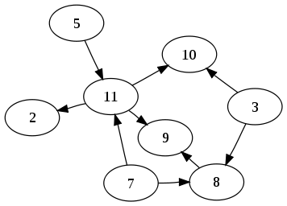

#StateFlow

> Try to describe the business logic flow of your application

This is a small tool for logic chains based on the middleware idea.

##Idea
If we examine the structure of your application, it will most likely be like this:


 
This means the structure of a [directed acyclic graph](http://en.wikipedia.org/wiki/Directed_acyclic_graph), and its nodes will contain the states of your application. Arrows will denote transactions of transitions between application states; [transaction](http://en.wikipedia.org/wiki/Transaction_processing) is understood as a sequence of operations required for transition to the subsequent application state.

> Take notice that currently the rollback mechanism is absent for [Atomicity](http://en.wikipedia.org/wiki/Transaction_processing#Atomicity) in a sequence of operations. Rollback is provided by the absence of state preservation during the execution of a logic chain. But further we are going to provide additional rollback API for every operation in transaction.

Thus every application state, as a rule, is described through the following three constituents: state name (for convenience), sequence of operations for trasition to the current state (transaction), and parameters of transaction launch.

For exmaple, the description of `flow` for transition to the state of displaying a screen with details, may be as follows:

```javascript
// one of possible ways to describe middleware
function showUserScreen(data, chain) {
	chain.switchTo('permission_screen', param);
}

// we describe the simplest transition transaction with an opportunity of halt and transition to another state
flow.to('details_screen')
    .process(checkUserRole)
    .error(showUserScreen)
    .process(showDetails)
    .described();
    
// when we need to move to the state 'details_screen', we execute:
flow.switchTo('details_screen', params);

// or if we need to stop the current transaction inside middleware, and start a new one, then:
chain.switchTo('permission_screen', param);
```
> `checkAuthorization`, `showLogin`, `showDetails` and `showDetails` are actual a challenge for **middleware**. They can be implemented by any means. (see [middleware API](##middleware API)).

##Advantages
- The application structure is described with transactions of transitions between application states. Each transaction consists of operations. Each operation is implemented via calling **middleware**
- A transaction may be interrupted and redirected. In contrast to standard approaches of describing operation sequences, there are three ways to end an operation: `next`, `error` and `switchTo`. This allows to easily describe the application structure with an opportunity of routing. 
- An opportunity of setting an execution context for **middleware**.
- Transaction of the transition flow can be interrupted.

##Example
Let's make an example of a description of transit flow:

```javascript
var checkAuthorization = function (params, chain) {
    // ...
    if (isNotAuthorized) {
        chain.switchTo('login', {
            state: chain.getСurrentState(),
            param: params
        })
    } else {
        chain.next(params);
    }
};

var showRequredScreen = function (params, chain) {
    if (params) {
        chain.switchTo(params.state, params.param)
    } else {
        chain.next();
    }
};

// flow.to('login')
    .process(showLoginScreen)
    .process(tryAuthorizate)
    .error(authorizationError)
    .process(showRequredScreen)
    .described('home');
    
// describe flow for 'user' state
flow.to('user')
    .process(checkAuthorization)
    .process(showLoader)
    .process(getUserDataFromServer)
    .error(errorHandler)
    .process(showUserScreen)
    .after(hideLoader)
    .described();

// swith to 'user' state with id=123    
flow.switchTo('user', {id: 123})
```
When we try to move to the state `user`, `checkAuthorization` is registered as our first operation; in case a user is not registered, we save our state and its login parameters as parameters for transition to the state `login`, execute all operations for login, and restore the transition to the state `user` with previous parameters.
> Take notice that during the description of **middleware** for login `flow` you will have to manually forward the transition parameters through all operations.

##Roadmap
- Rollback API for **middleware**.
- Opportunity of setting multiple parallel operations for `process` and `do`.
- Opportunity of using routing URL as a state name (for front-end and node.js), automatic transmission of URL parameters as transaction parameters. For example, `sequencer.pipe('/users/:id/)` will launch a transaction of transition to this state with `id` as a transaction parameter.
- Embedded states, which are described via `state.substate`.

```javascript
// root state
var userFlow = flow.to('/users/:id/)
    .process(checkAuthorization)
    .error(showLogin)
    .process(showUserScreen)
    .described();

// substate 
userFlow.to('/purchase/:id')
    //...
    .described();

// other substate 
userFlow.to('/history')
    //...
    .described();
```