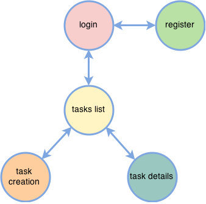
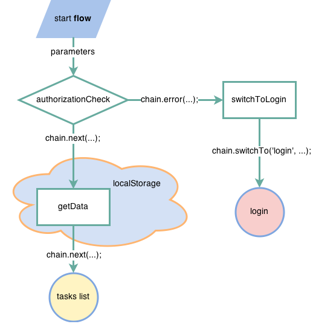
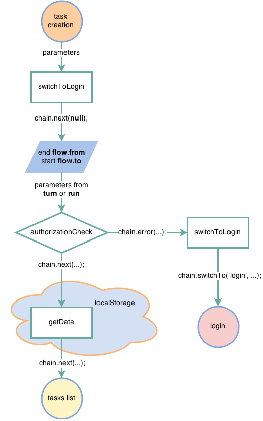

#Tutorial
В качестве небольшого примера использования `StateFlow` напишем **TODO list**, но с небольшими дополненими:

- *авторизацией и регистрацией*
- *окном деталей отдельной задачи*
- *отдельным окном создания задачи*
- *роутингом*
- *сохранением данных в хранилище*
- *и `декоративными` вещами*

То есть теми вещами которые незримо пресудствуют в любом приложении. 

##States
Начнем мы с понимания какие состояния существуют в нашем приложении. Если начертить граф состояний этого приложения, то получится следующее:



Опишем эти состояния в файле `flow.js`, который создадим:

```javascript
// create StateFlow instance
var StateFlow  = require("./source/lib/stateflow.js").create();
var state = StateFlow.state;
var flow = StateFlow.flow;

// attach callbacks to states
state('login').attach(screenManager.showLogin, screenManager);
state('register').attach(screenManager.showRegister, screenManager);
state('task_list').attach(screenManager.showTaskList, screenManager);
state('task_creation').attach(screenManager.showTaskCreation, screenManager);
state('task_details').attach(screenManager.showTaskDetails, screenManager);

// turn on base state
state('login').turn();
```
Ничего сверхестественного тут не происходит и все читаемо:

- Мы зарегестрировали в качестве коллбэк методов на переход в состояния пока абстрактные методы пока абстрактного `screenManager`'а.
- И в конце файла мы переключаем наше приложение в `'login' state`.

>Обратите так же внимание на строку:
>
```javascript
var StateFlow  = require("./source/lib/stateflow.js").create();
```
В ней мы не только получаем ссылку на `StateFlow`, но и создаем экземпляр синглтона `StateFlow`, и в следующий раз, в другом файле вы сможете работать с уже создаными `flow` и `state`, просто запросив `require("./source/lib/stateflow.js")`.

`state('login').turn();` Запускает переход в состояние `'login'`.

**Единовременно приложение может находится только в одном состоянии.**

> Если в метод `turn` передать объект данных то он будет переданы как первый параметр в первой операции транзакции(см. дальше), а если транзакция не описана или в ней нет операций, то этот объект данных будет передан во все коллбеки зарегистрированные на переход в это состояние.


##Flows
Теперь нам необходимо прописать транзакции перехода в состояние. Обратите внимание, что транзакция перехода описывается из двух частей:

1. `flow.from('...')` - **переход из текущего сотояния**
2. `flow.to('...')` - **переход в новое состояние**

А не как последовательность операций между ними. Это позволяет вводить дополнительные валидационные возможности.

###flow.to

Опишем `flow` перехода в `'task_list' state`, так как это состояние с нашей точки зрения является основным в этом приложении.

> Надо отметить что никто не мешает вам начать описывать последовательности переходов в состояния с любого другого состояния.

Для начала транзакция перехода в `'task_list' state` будет содержать следующие операции (`flow.js`):

```javascript
flow.to('task_list')
	.process(authorizationСheck)
	.error(switchToLogin)
	.process(getData, localStorage)
	.described();
```
По названиям операций в транзакции достаточно понятно что делает, каждая из них.

>Единственное что нужно уточнить является операция `getData` в `.process(getData, localStorage)` в этом случае мы использовали контекст выполнения для операции `getData`, для того чтобы если вам понадобится поменять хранилище вы просто поменяли контекст выполнения и все, так как это наглядно и просто (чуть более подробно далеее).

В графическом виде эту транзакцию **flow.to** можно отобразить следующим образом:



На рисунке четко видны переходы и маршрутизация между операциями в данной транзакции и какие методы вызываюются в каждой операции (**middleware**) для передачи управления далее.

Аналогично предидущей, опишем все транзакции для остальных состояний (`flow.js`):

```javascript
// describtion flow to 'login' state
flow.to('login')
	.process(checkUserIsNotLogged ) // check the user is not logged
	.error(switchToDestination) // switch to destination state or 'task_list' state as default
	.described();

// describtion flow to 'task_creation' state
flow.to('task_creation')
	.process(authorizationСheck)
	.error(switchToLogin)
	.described();	

// describtion flow to 'task_details' state
flow.to('task_details')
	.process(authorizationСheck)
	.error(switchToLogin)
	.described();	
```

>Обратите внимание что мы не описывали транзакцию для состояния `'register'`, так как в этом нет необходимости, потому что никакие операции во время перехода не выполняются.

###flow.from
В случае перехода из состояния `task_creation` мы должны будем выполнить сохраниение данных по зозданой задаче в хранилище:

```javascript
flow.from('task_creation')
	.process(saveData, localStorage)
	.described();	
```
И в этом случае транзакция перехода из состояния `task_creation` в  состояние `task_list` приобретает следующий вид:



> Обратите внимание на следующие тонкие моменты:
> 
> - переход между двумя состояниями является **одной** транзакцией
> - **flow.to** запустится только после окончания выполнения **flow.from**. А так как операции могут быть асинхронными, то Вы в явном виде должны вызвать `chain.next();` для передачи управления дальше. В качестве данных можно ничего не передавать т.к. параметры перехода в состояние `tasks_list` передаются только из `state('tasks_list').turn(params)` или `flow.to('tasks_list').run(params)`.

###use
У нас во всех транзакциях повторяется две операции `authorizationСheck` и `switchToLogin` их можно объеденить в отдельную последовательность операций которые можно указывать как одну.

Для этого необходимо описать новую последовательность которая включает в себя все повторяющиеся операции и потом включать ее там где необходимо с помошью `use`.

В этом случае у нас запись становится более лаконичной и более понятной, а файл `flow.js` приобретает следующий вид:

```javascript
// create StateFlow instance
var StateFlow  = require("./source/lib/stateflow.js").create();
var state = StateFlow.state;
var flow = StateFlow.flow;

// states describtion & attach callbacks
state('login').attach(screenManager.showLogin, screenManager);
state('register').attach(screenManager.showRegister, screenManager);
state('task_list').attach(screenManager.showTaskList, screenManager);
state('task_creation').attach(screenManager.showTaskCreation, screenManager);
state('task_details').attach(screenManager.showTaskDetails, screenManager);

// describtion subflow
flow.to('sub_check_user')
	.process(authorizationСheck)
	.error(switchToLogin)
	.described();	

// describtion flow to 'login' state
flow.to('task_list')
	.use('sub_check_user')
	.process(getData, localStorage)
	.described();
	
// describtion flow to 'login' state
flow.to('login')
	.process(checkUserIsNotLogged ) // check the user is not logged
	.error(switchToDestination) // switch to destination state or 'task_list' state as default
	.described();

// describtion flow to & from 'task_creation' state
flow.to('task_creation')
	.use('sub_check_user')
	.described();	
flow.from('task_creation')
	.process(saveData, localStorage)
	.described();	

// describtion flow to 'task_details' state
flow.to('task_details')
	.use('sub_check_user')
	.described();	
	
// turn on base state
state('login').turn();
```
> Обратите внимание на два момента:
> 
> 1. подпоследовательность должна быть описана **до** ее использования
> 2. оператор `use` не вызывает эту под последовательность во время выполнения основной, вместо этого он указавает что в момент описания(вызова `described`), необходимо продублировать последовательность вызова операций в основную транзакцию. Дублируется только последовательность, а не сами операции.

Теперь, для того чтобы окончить описание базового функционала опишем операции в транзакциях(**middleware**).

##Middleware
Все **middleware** имеют одинаковый API выглядящий следующим образом:

```javascript
function middleware(data, chain) {
	// your code
	// ..
	
	// transfer of control to next operation
	chain.next(newData);
}
```
Тоесть фактически **middleware** это функция, которая принимает 2 входных параметра:

1. **data**, первый параметр - данные которые были переданны как параметр при запуске транзакции или передаче управления из предидущей операции.
2. **chain** - вспомогательный объект который предоставляет API для передачи управления к следующей операции в транзакции.

> В связи с тем что для **middleware** вы можете устанавливать контекст выполнения, было бы некоректно внедрять методы управления последовательностью операций через миксин, так как это моглобы привести к конфликту имен. Поэтому их передача и реализована через методы вспомогательного объекта.   

**Middleware** API для `.process(middleware)`, `.do(middleware)` и `.error(middleware)` ничем не отличаются, а это означает что вы можете одну и туже операцию использовать в разных транзакциях, проектах

###chain.next
Вызывая этот метод вы передаете управление в следующую операцию, а объект данных который был указан как параметр вызова данной операции будет передан в следующую операцию как первый параметр.  

###chain.error

###chain.swichTo

###chain.reject
